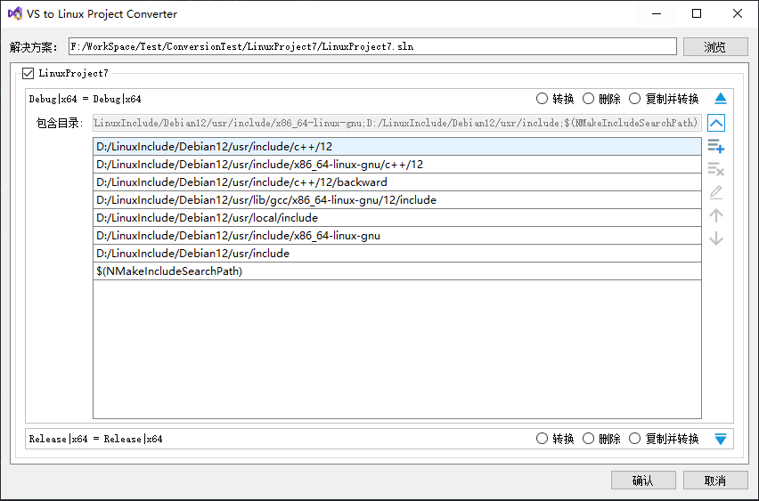
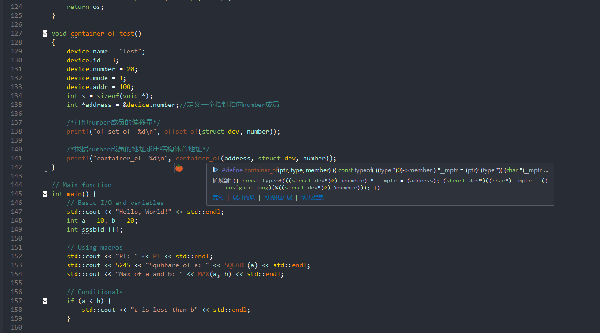

# Visual Studio 项目转换 Linux Project

**将现有的VisualGDB工程转换为Linux项目类型以加强intellisense支持而不改变VisualGDB项目属性**

​        当创建VisualGDB Linux 应用程序项目时，VisualGDB会默认创建一个基于Win32的项目文件（.vcxproj）  
而不是基于Linux的项目文件。当使用Visual Studio 的IntelliSense而不是VisualGDB的Clangd引擎进行解析时  
这会导致IntelliSense无法正确识别Linux特定的代码和库从而影响代码补全和错误检测功能。   
为了解决这个问题，我们可以手动修改项目文件，将其转换为基于Linux的项目文件  
例如一些gcc的方言 typeof	、__atomic 参见 https://gcc.gnu.org/onlinedocs/gcc-9.1.0/gcc/C-Extensions.html#C-Extensions  
而这些方言在 Toolset IntelliSense Identifier 为 Linux 时是可以正确识别的，利用Visual Studio中的该特性实现了该工具。

**！！！目前只在Visual Studio 2022 上测试过，使用前请先做好备份**

**转换后的含gnu方言代码高亮提示：**

**错误列表仅剩少量错误不影响intellisense和智能提示：**

